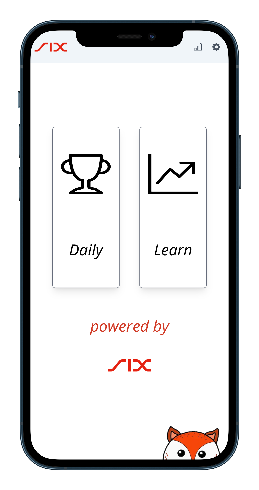
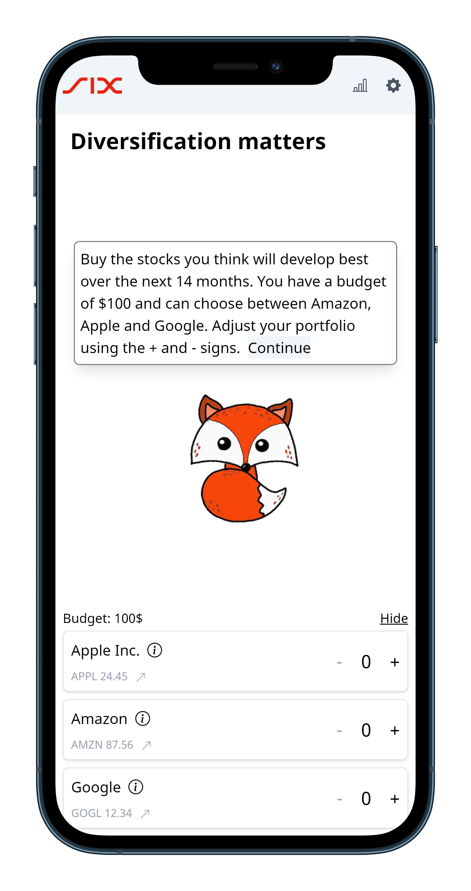
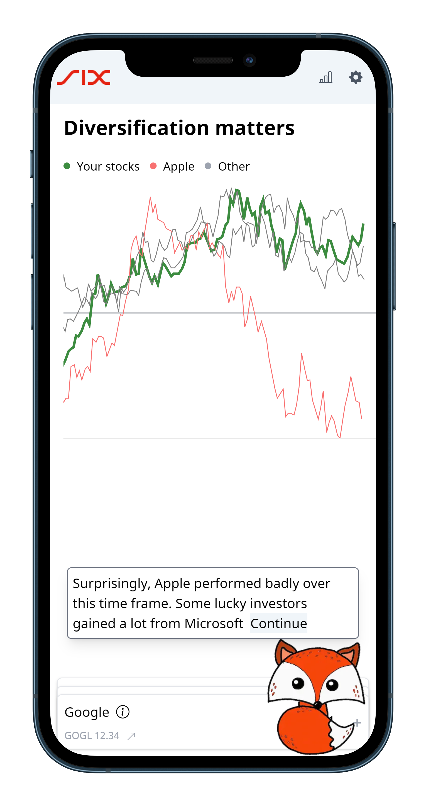
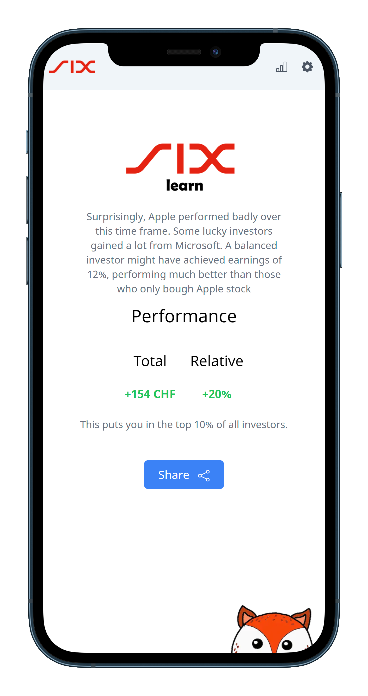

# 6learn

<p align="middle">
    
    
</p>

<p align="middle">
    
    
</p>

This is our solution as web-based application for the [problem case of SIX at StartHack23](https://github.com/START-Hack/SIX_STARTHACK23_INCLUSIVE_FINANCE).
It has been developed **mobile-first**

## Run the project

```bash
npm run i && npm run dev
```

Alternatively, you can build (`npm run build`) and start (`npm run start`)

The project will run on http://localhost:3000/

## Additional notes
Be aware that this project has been crafted in a limited time. It might have happened
that we have workaround some problems in ways you normally wouldn't do or hardcoded things
(e.g. to be able to demo the application on any phone). Nevertheless, API Calls are implemented
(see source)

## Contributors

in alphabetical order:

* Ackermann Dario, [dackermann@ethz.ch](mailto:dackermann@ethz.ch)
* Armstrong Ben, [barmstron@ethz.ch](mailto:barmstron@ethz.ch)
* Vogt Valentin, [vogtva@ethz.ch](mailto:vogtva@ethz.ch)
* Warnking Tizian, [twarnking@ethz.ch](mailto:twarnking@ethz.ch)

Copyright 2023. All rights reserved.